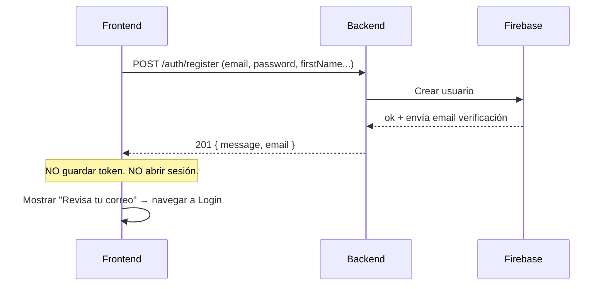
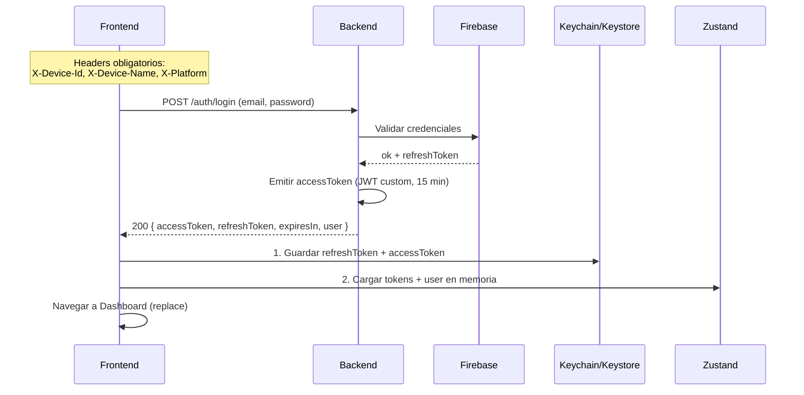
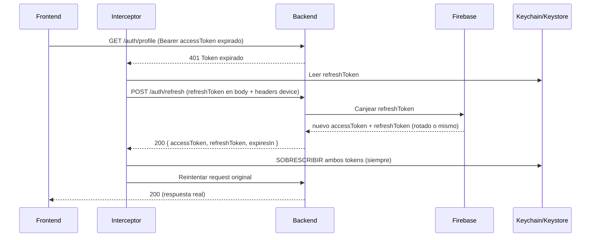
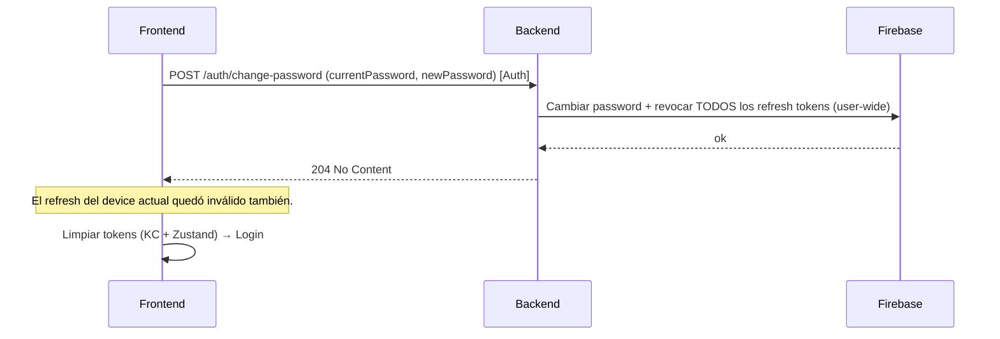
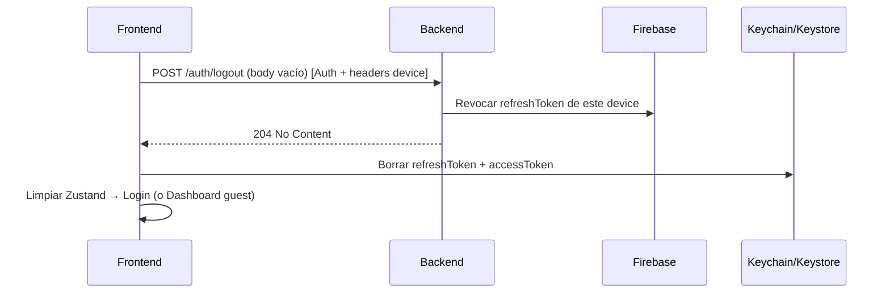
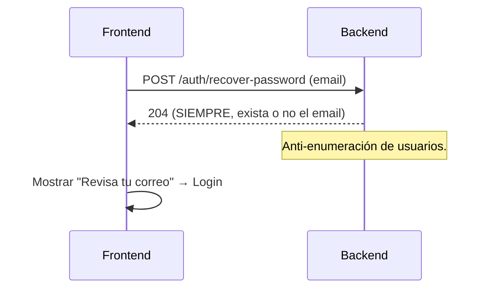
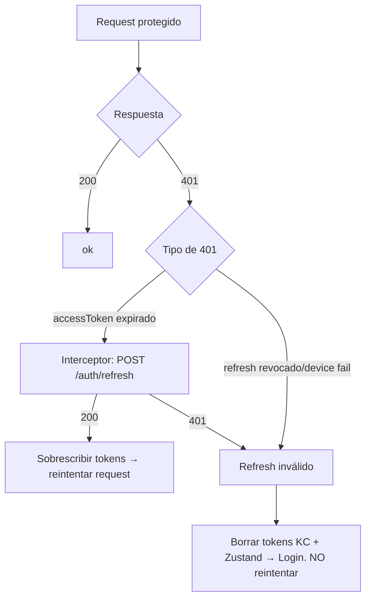

# 🔄 Flujo de Autenticación — `/auth`

> Cómo funciona la auth de Kashy de punta a punta. Basado en [`router/authentication.md`](../router/authentication.md).
> **Principio:** El frontend nunca habla con Firebase directo — todo pasa por el backend.

---

## Componentes

| Componente | Rol |
| ---------- | --- |
| **Frontend (React Native)** | Captura credenciales, guarda tokens, dispara refresh, navega. |
| **Backend Kashy** | Único intermediario. Valida credenciales contra Firebase, emite `accessToken` (JWT custom). |
| **Firebase** | Fuente de verdad de auth. Valida credenciales, emite/rota `refreshToken`. |
| **Keychain / Keystore** | Almacén cifrado persistente. Fuente de verdad de tokens en el device. |
| **Zustand** | Estado en memoria. Copia de trabajo rápida de tokens + `user`. |

### Dos tokens, dos vidas

| Token | Emisor | Vida | Uso |
| ----- | ------ | ---- | --- |
| `accessToken` | Backend (JWT custom) | 15 min (`expiresIn: 900`) | `Authorization: Bearer {jwt}` en rutas protegidas. |
| `refreshToken` | Firebase | Larga, rotable | Canjear por nuevo `accessToken` vía `/auth/refresh`. El crítico. |

---

## Regla de escritura de tokens

> Orden **obligatorio** al recibir tokens del backend:

1. **Sobrescribir** Keychain/Keystore (fuente de verdad persistente).
2. Luego actualizar Zustand (memoria).

Nunca al revés. Keychain primero, memoria después.

---

## Flujo 1 — Registro

> `POST /auth/register` **no** abre sesión. Requiere verificación de email.

**Errores:** `409` email duplicado · `422` validación (mapear `fields[]`).

---

## Flujo 2 — Login (email/password y Google)

> Misma salida para `/auth/login` y `/auth/login/google`: tokens + `user`.

**Variante Google:** FE obtiene `googleIdToken` con Google Sign-In SDK → lo envía en body. Auto-registro asigna `countryCode = 'VE'` por defecto.

**Errores:** `401` credenciales inválidas o **email no verificado**.

---

## Flujo 3 — Request protegido + refresh automático

> Corazón del sistema. El `accessToken` vive 15 min; al expirar, el interceptor lo renueva sin que el usuario lo note.

**Claves:**

- `/auth/refresh` es **pública** (sin `Authorization`). El `refreshToken` del body es el credencial; Firebase lo valida cripto.
- `X-Device-Id` debe coincidir con `user_devices` (device binding).
- **Rotación silenciosa:** Firebase puede rotar el refresh. Siempre sobrescribir, aunque parezca igual. Usar el viejo tras rotación = `401`.

**Falla de refresh (`401`):** refresh revocado/expirado o device mismatch → **borrar ambos tokens + limpiar Zustand → login. No reintentar.**

---

## Flujo 4 — Cambio de contraseña

> Revoca **todos** los refresh tokens del usuario en Firebase (user-wide). Cierra sesión en todos los devices.

**Por qué re-autenticar:** el refresh local también murió. Cualquier refresh posterior daría `401`. Re-login = forma limpia de obtener tokens frescos.

---

## Flujo 5 — Logout

**Crítico:** El cliente **debe** borrar tokens al recibir `204`. Si no, el `refreshToken` sigue válido contra Firebase hasta expirar o cambio de password.

---

## Flujo 6 — Recuperar contraseña

No esperar `422` — el backend silencia errores de validación por seguridad.

---

## Manejo global de `401`

---

## Reglas de almacenamiento (resumen)

- ✅ `refreshToken` + `accessToken` → **Keychain / Keystore** cifrado.
- ✅ `user` + tokens en memoria → **Zustand** (rehidratado desde Keychain o `GET /auth/profile`).
- ✅ Preferencias UI no sensibles → **AsyncStorage**.
- ❌ **Nunca** tokens en `AsyncStorage`, `SharedPreferences` plain, `NSUserDefaults` o archivos sin cifrar.
- ❌ **No** sincronizar `refreshToken` a iCloud Keychain ni Google Backup (refresh es per-device).

---

## Matriz de endpoints

| Método | Ruta | Auth | Abre sesión | Headers device |
| ------ | ---- | :--: | :---------: | :------------: |
| `POST` | `/auth/register` | ❌ | ❌ | ❌ |
| `POST` | `/auth/login` | ❌ | ✅ | ✅ |
| `POST` | `/auth/login/google` | ❌ | ✅ | ✅ |
| `POST` | `/auth/refresh` | ❌ | renueva | ✅ |
| `POST` | `/auth/recover-password` | ❌ | ❌ | ❌ |
| `POST` | `/auth/change-password` | ✅ | cierra todas | ✅ |
| `GET`  | `/auth/profile` | ✅ | — | ✅ |
| `PATCH`| `/auth/profile` | ✅ | — | ✅ |
| `POST` | `/auth/logout` | ✅ | cierra una | ✅ |

> Todas las rutas con prefijo `/api/v1`. `X-Platform`: `ios` | `android`. `X-App-Version` opcional.
